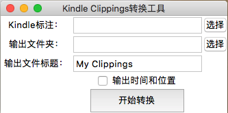

# Kindle标注导出

从Kindle标注文件“My Clippings.txt”中导出至单个html。

## GUI版

下载不同操作系统版本，打开，如下图所示，默认转出为html格式。



## 命令行版使用方法

使用Python3版本：

```
python kindle-clippings-export.py -i "My Clippings.txt" -o out-file-name.html
```

输出文件根据`out-file-name`后缀判断输出word文档（docx）或markdown文件（md）。


Markdown文件也可以用pandoc工具输出为html文件。


### 参数

-i: 输入文件名。

-o: 输出文件名，输出文件格式文件名后缀（docx或md）选择输出word文件或markdown文件。

-p: 若添加该参数，输出文件中增加标注时间和位置信息。

## 下一步计划

- [x] 添加GUI。
- [x] 完善GUI功能。
